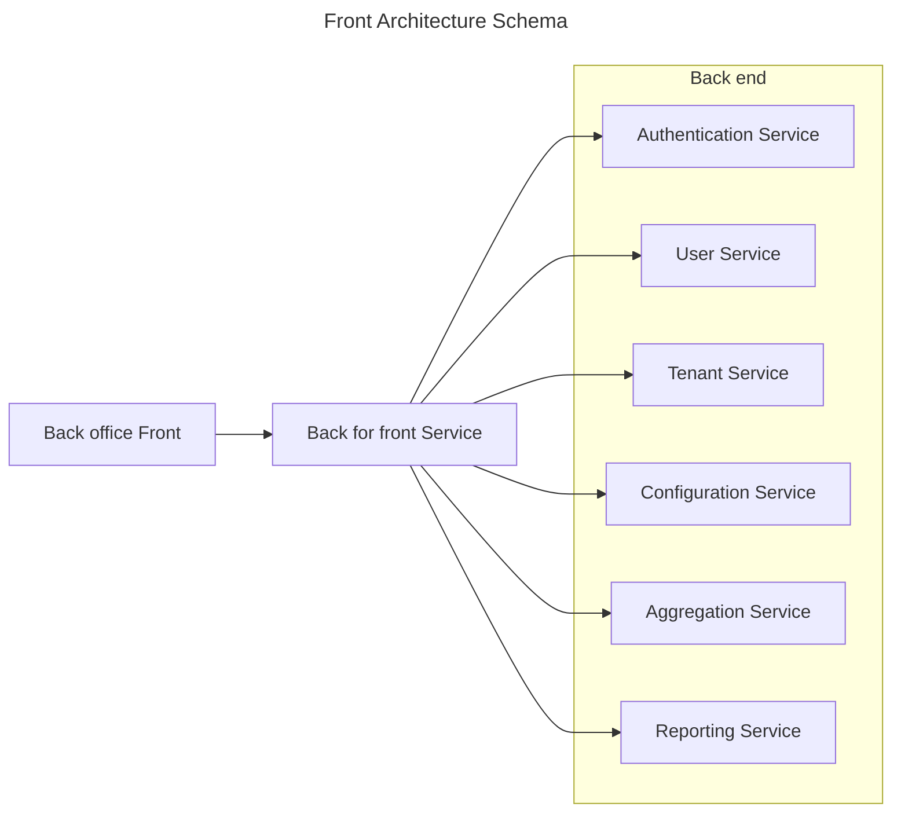
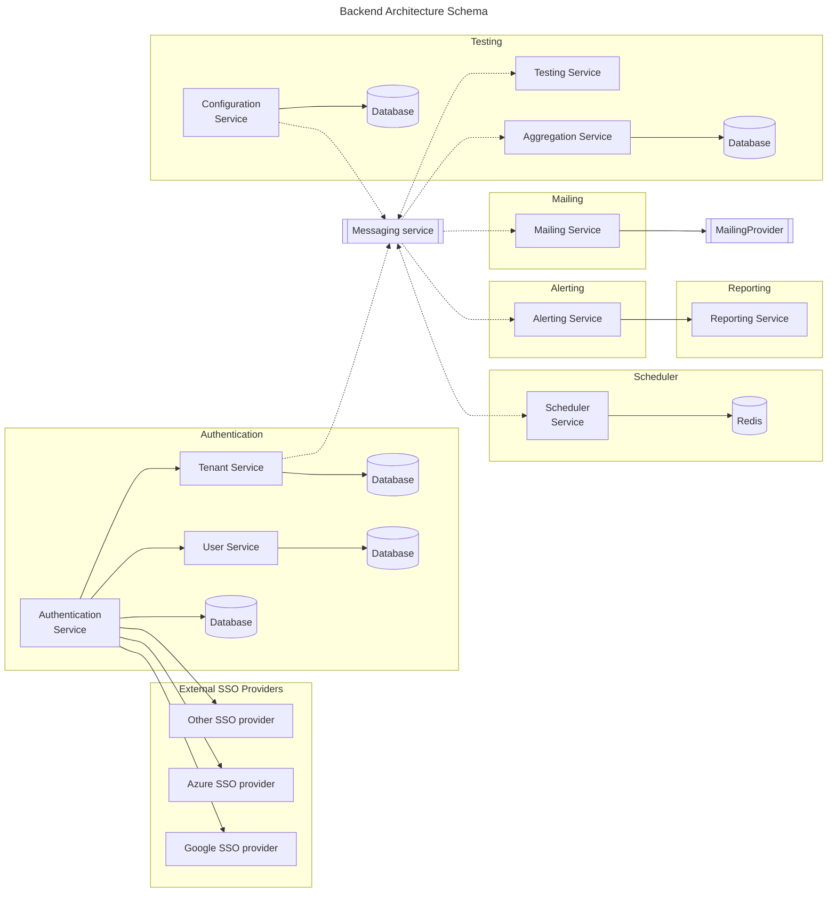

# Supervisor

<!-- TABLE OF CONTENTS -->

  
Table of Contents

  <ol>
    <li>
      <a href="#about-the-project">About The Project</a>
      <ul>
        <li><a href="#built-with">Built With</a></li>
      </ul>
    </li>
    <li><a href="#roadmap">Roadmap</a></li>
    <li><a href="#contributing">Contributing</a></li>
    <li><a href="#license">License</a></li>
    <li><a href="#contact">Contact</a></li>
  </ol>

<!-- ABOUT THE PROJECT -->
## About The Project

It's a project to periodically test APIs endpoints, send alerts and get APIs status reports

### Built With

* [![Dapr][Dapr]][Dapr-url]
* [![Spring][Spring]][Spring-url]
* [![Kotlin][Kotlin]][Kotlin-url]
* [![Vue][Vue.js]][Vue-url]

(<a href="#readme-top">back to top</a>)

<!-- ROADMAP -->
## Roadmap

- [ ] Tenant service
- [ ] User service
- [ ] Authentication service with support External SSO providers
    - [ ] Google SSO
    - [ ] Azure SSO
- [ ] Back office web site
    - [ ] Create tenant with admin user
    - [ ] Login user
    - [ ] Register users
    - [ ] Modify user roles
- [ ] Configuration Service
    - [ ] Manage Api test configuration
    - [ ] Send configuration to Messaging hub
- [ ] Scheduler Service
    - [ ] Periodical ask to Testing Service to test API
- [ ] Testing Service
    - [ ] Test Api endpoint with provided configuration
    - [ ] Send test Api result to Messaging hub
- [ ] Aggregation Service
    - [ ] Receive and save test Api result from Messaging hub
    - [ ] Aggregate result and save it
- [ ] Alerting Service
    - [ ] Send Alert on test api error which depends of testing configuration
- [ ] Reporting Service

See the [open issues](https://github.com/github_username/repo_name/issues) for a full list of proposed features (and known issues).

(<a href="#readme-top">back to top</a>)

<!-- CONTRIBUTING -->
## Contributing

Any contributions you make are **greatly appreciated**.

If you have a suggestion that would make this better, please fork the repo and create a pull request. You can also simply open an issue with the tag "enhancement".
Don't forget to give the project a star! Thanks again!

1. Fork the Project
2. Create your Feature Branch (`git checkout -b feature/AmazingFeature`)
3. Commit your Changes (`git commit -m 'Add some AmazingFeature'`)
4. Push to the Branch (`git push origin feature/AmazingFeature`)
5. Open a Pull Request

(<a href="#readme-top">back to top</a>)

<!-- LICENSE -->
## License

Distributed under the Apache License 2.0 with Commons Clause License Condition v1.0. See `LICENSE.txt` for more information.

(<a href="#readme-top">back to top</a>)

<!-- CONTACT -->
## Contact

Guillaume Fortin - gfortin@neetrof.fr

Project Link: [https://github.com/NEETROF/supervisor](https://github.com/NEETROF/supervisor)

(<a href="#readme-top">back to top</a>)

<!-- MARKDOWN LINKS & IMAGES -->
<!-- https://www.markdownguide.org/basic-syntax/#reference-style-links -->
[Vue.js]: https://img.shields.io/badge/Vue.js-35495E?style=for-the-badge&logo=vuedotjs&logoColor=4FC08D
[Vue-url]: https://vuejs.org/
[Kotlin]: https://img.shields.io/badge/kotlin-%237F52FF.svg?style=for-the-badge&logo=kotlin&logoColor=white
[Kotlin-url]: https://kotlinlang.org/
[Spring]: https://img.shields.io/badge/spring-%236DB33F.svg?style=for-the-badge&logo=spring&logoColor=white
[Spring-url]: https://spring.io/
[Dapr]: https://img.shields.io/badge/Dapr-0D2192.svg?style=for-the-badge&logo=Dapr&logoColor=white
[Dapr-url]: https://dapr.io/

## Architecture Schema

